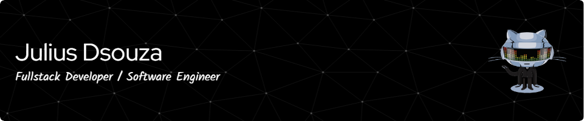

# Hi there, My name is Julius and Welcome to my Github Page! 👋 

 

  

### A Little Bit About Me:

- 🔭 I am a Software Developer / Full Stack Engineer with over 2 years of experience.
- 🌱 In my free time, I like working on Full Stack and Machine Learning based projects.
- 🥅 2022 Goals: Contributing to Open Source Projects.
- 📫 How to reach me: **jsdsz1996@gmail.com**

  

#### I am currently pursuing my Masters in Computer Engineering from NYU and I will be graduating by December 2023. 

#### Do reach out to me if you'd like to collaborate or are providing SDE / Full Stack / Front End opportunities.

---

### Connect with me:

&nbsp;&nbsp;

&nbsp;&nbsp;

### Languages and Tools:

  

---

 

  
:zap: GitHub Stats

  

